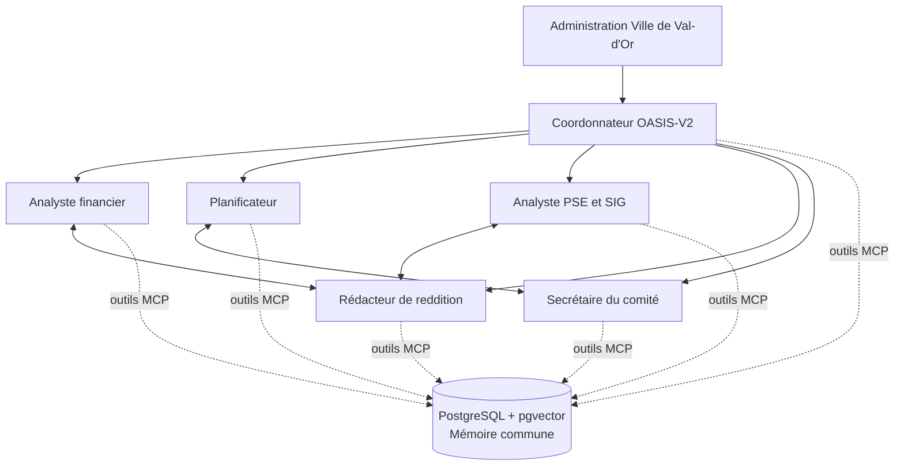

# Spacebot OASIS-V2 — Déploiement local Docker

Cette configuration prépare une instance Spacebot destinée au suivi de la convention **COV_OASIS-V2** de la Ville de Val-d'Or. L’interface Web locale constitue le point d’entrée. Un coordonnateur délègue aux profils spécialisés; les faits, décisions, résultats, risques et références utiles sont enregistrés dans une mémoire commune fondée sur **PostgreSQL + pgvector**, accessible à tous les profils par un serveur MCP local.

> Le service partagé est nécessaire parce que Spacebot isole par défaut la mémoire de chaque agent. Les profils gardent donc une mémoire de conversation propre, tout en utilisant le registre PostgreSQL-vectoriel comme source interagent faisant autorité. [1]

| Élément | Rôle | Persistance |
| --- | --- | --- |
| `spacebot-oasis-v2` | Interface Web, topologie des agents, tâches, conversations, mémoire locale de chaque profil, terminal borné et Python 3 pour les scripts locaux. | `instance/` |
| `oasis-memory-db` | Registre commun relationnel, historique d’audit, liens entre éléments et vecteurs pgvector. | `volumes/postgres/` |
| `oasis-shared-memory` | Serveur MCP interne : écritures contrôlées, recherche sémantique, lecture de dossiers et liens de traçabilité. | Sans état; s’appuie sur PostgreSQL |
| `oasis-gis` | Serveur MCP SIG local : inventaire KML, export GeoJSON et intersections par emprise P1/P2/P3. | `instance/shared-workspace/` |
| `oasis-document-studio` | Serveur MCP documentaire local : DOCX/PDF, aperçu PNG et contrôle qualité. | `instance/shared-workspace/` |
| `oasis-optimizer` | Boucle DSPy : évalue et propose des améliorations d’instructions courtes sur cas approuvés. | `instance/shared-workspace/00_systeme/optimisation/` |
| `oasis-skillopt` | Boucle SkillOpt : apprend de façon périodique une procédure `SKILL.md` autorisée, sur partitions de test séparées. | `instance/shared-workspace/00_systeme/optimisation/skillopt/` |
| `oasis-reference-miner` | Mineur local : extrait, dépersonnalise et dédoublonne des candidats de référence issus d’enregistrements explicitement admissibles. | `instance/shared-workspace/00_systeme/optimisation/reference-miner/` |
| `oasis-failure-remediator` | Lit les tentatives Spacebot échouées, bloquées ou expirées; dépersonnalise et dédoublonne une leçon ou une demande de capacité candidate. | `instance/shared-workspace/00_systeme/optimisation/failure-remediator/` |
| `oasis-approval-bridge` | Crée les tâches d’approbation dans l’interface et applique seulement les candidates explicitement approuvées. | `instance/approved-skill-overlays/` et `00_systeme/optimisation/approval-bridge/` |
| OpenRouter | Routage des modèles de génération et création d’embeddings; les vecteurs générés sont mis en cache dans PostgreSQL. | Compte OpenRouter de la Ville |

## Profils et circulation du travail

| Profil | Mandat principal | Utilise systématiquement | Résultat transmis au coordonnateur |
| --- | --- | --- | --- |
| **Coordonnateur OASIS-V2** | Point d’entrée Web, clarification, planification, délégation et consolidation. | Registre partagé, tâches, liens hiérarchiques. | Plan de travail, synthèse, décisions à approuver. |
| **Analyste financier** | Budget, dépenses, salaires, contrats, appels d’offres, admissibilité et écarts. | Budget approuvé, registre des dépenses, pièces de preuve. | État financier et alertes de conformité. |
| **Planificateur** | Calendrier compressé, Gantt, dépendances et jalons. | Calendrier approuvé, décisions, risques et dates contractuelles. | Version de travail, écarts et actions correctives. |
| **Analyste PSE et SIG** | PSE, KML, superficies, indicateurs et méthode de vulnérabilité. | KML, rapport technique, gabarit PSE, méthode MELCCFP. | Matrice d’indicateurs, calculs et limites SIG. |
| **Rédacteur de reddition** | Rapports d’étape/final, annexes et contrôle de conformité. | PSE, budget, calendrier, résultats et preuves. | Brouillon, liste des annexes et informations manquantes. |
| **Secrétaire du comité** | Convocations, ordres du jour, PV, décisions et relances. | Registre des décisions et risques, calendrier. | PV à valider, plan d’action et suivi des responsables. |

Les liaisons sont préconfigurées dans `config.toml.example`. L’administration municipale encadre le coordonnateur. Celui-ci dirige les cinq profils spécialisés. Des liaisons entre pairs existent entre finances et reddition, PSE/SIG et reddition, ainsi qu’entre calendrier et gouvernance.



## Routage OpenRouter orienté coût

Le routage n’utilise aucun modèle Claude. Les modèles de génération sont sélectionnés dans le catalogue OpenRouter et restent séparés par niveau de responsabilité; le modèle visuel plus coûteux n’est utilisé qu’à la demande pour les documents scannés ou les plans. Les identifiants et prix doivent être revérifiés avant l’activation, puisqu’OpenRouter les fait évoluer. [2]

| Processus | Modèle configuré | Fonction | Justification de coût |
| --- | --- | --- | --- |
| Conversation de l’interface | `openrouter/deepseek/deepseek-v4-flash` | Échanges, suivi de contexte et délégation. | Niveau économique pour les interactions courantes. |
| Analyse / arbitrage | `openrouter/openai/gpt-oss-120b` | Plans complexes, consolidation, rapports sensibles. | Déclenché sur les tâches nécessitant plus de raisonnement. |
| Travailleurs spécialisés | `openrouter/qwen/qwen3.7-flash` | Extraction structurée, tableurs, KML, contrôles et brouillons. | Faible coût pour les tâches fréquentes et répétables. |
| Compaction et cortex | `openrouter/mistralai/mistral-nemo` | Résumés, mémoires et signaux de gestion. | Modèle très économique; aucune décision contractuelle. |
| Documents visuels | `openrouter/google/gemini-2.5-flash-lite` | Lecture ponctuelle de plans, scans et PDF difficiles. | Usage exceptionnel et ciblé. |
| Embeddings communs | `qwen/qwen3-embedding-0.6b` | Recherche vectorielle multilingue dans PostgreSQL. | Généré une seule fois par contenu nouveau ou modifié, puis conservé. |

> Les données envoyées à un modèle OpenRouter restent soumises aux politiques du fournisseur retenu. Le serveur d’embeddings demande explicitement `data_collection: "deny"`; l’équipe TI doit néanmoins valider le traitement externe de documents municipaux avant de déposer des pièces confidentielles. [3]

## Sobriété de jetons et réglages fins

La configuration réduit d’abord le **contexte répété** : une seule branche et un seul worker peuvent être actifs, le canal est limité à trois tours, une branche à six tours et seulement douze messages sont réhydratés lorsqu’un canal est rouvert. La fenêtre de contexte est fixée à 96 000 jetons; elle suffit aux livrables complexes tout en forçant l’évacuation contrôlée du contexte non essentiel. Les tâches autonomes se limitent à une proposition toutes les quatre heures, avec un seul travail proposé et au plus quatre tours.

La compression **Chronicle** est activée tôt — à 72 % de la fenêtre — et ne rend que quatre checkpoints récents et six anciens dans un budget de **1 200 jetons**. Les checkpoint sont plus courts et plus fréquents, ce qui évite qu’une longue conversation soit renvoyée intégralement à chaque échange. La persistance automatique de mémoire et la réflexion automatique sur les compétences sont désactivées : seules les données factuelles, décisions, risques et livrables vérifiables sont explicitement enregistrés dans le registre commun. Cette stratégie préserve la traçabilité sans ouvrir des branches silencieuses de synthèse. [4] [5]

Les outils coûteux en contexte sont ciblés. La mémoire commune est disponible à tous les profils; l’atelier documentaire est chargé uniquement par les profils qui produisent des livrables, le SIG uniquement par PSE/SIG, et le navigateur uniquement par le coordonnateur. Les recherches vectorielles retournent cinq extraits courts par défaut; le détail d’une fiche est chargé seulement lorsque nécessaire. Les requêtes identiques sont temporairement mises en cache et une mise à jour d’enregistrement strictement inchangée ne déclenche ni nouvel embedding ni écriture d’audit.

OpenCode est activé pour les **tâches de développement multi-fichiers** seulement; le modèle `openrouter/openai/gpt-oss-120b` est alors sélectionné par la surcharge `coding`. L’image contient le binaire OpenCode officiel versionné; un seul serveur persistant peut être créé, avec un démarrage limité à 45 secondes et deux redémarrages. Les workers intégrés de Spacebot demeurent la voie par défaut pour les calculs SIG, la production documentaire, les commandes ponctuelles et les analyses non liées au code. Les permissions d’édition et de terminal sont nécessaires au développement local, tandis que `webfetch` est désactivé; les mises à jour et téléchargements LSP automatiques sont aussi désactivés.

## Démarrage local

La pile nécessite Docker Engine avec le plugin Compose. Sur la machine locale, clonez le dépôt, rendez-vous dans ce répertoire, puis exécutez les étapes ci-dessous.

```bash
cp .env.example .env
# Éditez .env : OPENROUTER_API_KEY, OASIS_MEMORY_DB_PASSWORD et les quatre jetons internes requis.
chmod 600 .env

./bootstrap_instance.sh

docker compose up -d --build
docker compose ps
```

Ouvrez ensuite <http://127.0.0.1:19898>. L’interface est liée à `localhost` pour ne pas être exposée directement au réseau. Une exposition réseau exige un proxy inverse avec HTTPS, authentification et contrôle d’accès; elle ne doit pas être activée par défaut.

## Ingestion documentaire et livrables

Après le démarrage, copiez les documents originaux dans `instance/shared-workspace/01_sources/00_inbox/`. Demandez ensuite à l’interface Web de les classer avec l’outil `classify_workspace_document`, qui ne peut déplacer un fichier que vers un dossier autorisé par `00_systeme/taxonomie_documentaire.json`. Les versions préparées par les agents sont séparées entre brouillons, revue qualité, documents approuvés et transmissions.

| Dossier local | Usage | Versionné dans Git |
| --- | --- | --- |
| `01_sources/00_inbox/` | Point d’entrée de toute pièce nouvelle. | Non |
| `01_sources/01_convention` à `01_sources/06_pieces_financieres` | Sources officielles classées. | Non |
| `02_finances` à `06_reddition` | Dossiers de travail par fonction et par obligation. | Non |
| `07_livrables/01_brouillons` à `07_livrables/04_transmis` | Cycle de vie distinct des livrables. | Non |
| `08_archives/` | Versions remplacées, pièces non admissibles et exports. | Non |
| `instance/agents/*/data/` | Données internes par profil (SQLite, LanceDB, réglages). | Non |
| `volumes/postgres/` | Mémoire relationnelle et vectorielle interagent. | Non |

## Chaîne SIG et documentaire

Le service `oasis-gis` traite localement le KML et les GeoJSON déposés dans l’espace de travail : `inspect_kml` inventorie les objets et leurs mesures géodésiques, `export_kml_geojson` produit un GeoJSON de travail et `project_surface_analysis` calcule les intersections avec des emprises de projet. Le calcul final reste conditionnel à la création ou l’import de trois emprises polygonales validées, `P1`, `P2` et `P3`, car le KML brut contient aussi des objets techniques et des hachures. Les données SIG ne sont pas envoyées à OpenRouter par ces outils.

Le service `oasis-document-studio` donne aux agents les outils `get_document_taxonomy`, `classify_workspace_document`, `create_document_brief`, `render_markdown_document`, `check_document_quality` et `render_document_preview`. Ils produisent localement des livrables DOCX/PDF à partir d’un Markdown structuré, utilisent une charte OASIS, créent un aperçu PNG de la première page et vérifient pages, texte extractible et polices. La procédure `oasis-document-studio` impose une revue visuelle des pages sensibles et une approbation humaine avant diffusion officielle.

## Compétences préchargées par profil

Chaque agent charge systématiquement la compétence commune `oasis-foundation`, qui impose la traçabilité, le classement, la mémoire partagée, l’approbation humaine et la sobriété des échanges. Tous reçoivent aussi `oasis-failure-learning` : elle interdit de répéter une tentative identique, impose un diagnostic court et dépersonnalisé, puis exige la vérification des compétences, outils et MCP déjà chargés. Tous reçoivent également `oasis-python-workbench`, qui encadre la création, la compilation et l’essai de scripts Python locaux ainsi que la recherche de compétences manquantes. Les autres compétences sont copiées dans le workspace du profil lors de l’initialisation : le coordonnateur reçoit la coordination, les procédures financières, calendaires, PSE, de reddition, documentaires, l’optimisation DSPy, l’apprentissage SkillOpt et le minage de références; l’analyste financier reçoit finance, reddition et documents; le planificateur reçoit calendrier, reddition et documents; l’analyste PSE/SIG reçoit SIG et documents; le rédacteur reçoit reddition, documents, finances et PSE; et le secrétaire reçoit gouvernance, calendrier et documents.

Cette répartition évite de charger à tous les agents des instructions inutiles tout en laissant les procédures communes disponibles. Les compétences sont uniquement des directives opératoires; les données factuelles demeurent dans le registre commun et les dossiers classés.

## Scripts Python locaux et compétences manquantes

L’image Spacebot OASIS contient **Python 3**, `venv` et `pip`; les six agents disposent du terminal sandboxé de Spacebot, borné à leur workspace. Ils peuvent donc créer et exécuter des scripts locaux à partir de l’interface Web, sans passer par un service externe. Chaque script doit être classé dans `00_systeme/scripts/<agent-id>/`, accompagné d’un README, compilé avec `python3 -m py_compile` et essayé sur une entrée non destructive avant de contribuer à un livrable. Le générateur `scaffold_oasis_python_script.py` fourni dans la compétence crée ce squelette avec des arguments explicites et des contrôles de chemin.

Les agents doivent d’abord inventorier les compétences, scripts, gabarits, binaires et MCP existants. Lorsqu’une compétence est réellement manquante, ils peuvent la rechercher dans le registre avec l’outil natif `skills_search`, mais ne doivent pas exécuter du code téléchargé. Ils préparent alors un fichier `capability_skill_acquisition` dans `00_systeme/propositions_capacites/`. Le pont transforme automatiquement ce fichier en une tâche `pending_approval` dans Spacebot. Après **Approve**, l’agent ciblé peut seulement installer la source approuvée dans son propre workspace avec `install_skill`, relire la compétence, l’essayer sur une tâche non sensible et consigner l’essai. Le pont n’installe aucun code et n’autorise jamais un MCP, un modèle, Docker, une permission, un secret ou une dépendance système.

> La création de scripts locaux est autonome et contrôlée par les limites de workspace. Une compétence externe reste soumise à une revue humaine, parce qu’elle introduit des instructions provenant d’un dépôt tiers. Les dépendances Python ne peuvent pas être installées par les agents sans une proposition de capacité et une approbation explicite.

## Boucle d’amélioration supervisée inspirée de DSPy

Le coordonnateur dispose seul du service `oasis-supervised-optimizer` et de la compétence correspondante. Cette boucle reprend le principe DSPy : exécuter des exemples de référence, appliquer des métriques, produire des variantes d’instructions et comparer les scores. Elle est limitée à des cas **dépersonnalisés et explicitement approuvés**; aucun rapport réel, document confidentiel, secret ou changement de production ne peut y être introduit. [6] [7]

Le conteneur et l’outil DSPy sont **actifs par défaut** au démarrage de la pile (`OASIS_OPTIMIZER_ENABLED=true`). Ils restent utilisables manuellement sur un jeu `approved`, mais le pipeline local peut aussi leur transmettre un pack temporaire `system_validated`, dépersonnalisé et limité aux instructions, après le minage autonome. Ce chemin est authentifié par un jeton Docker interne et produit un seul candidat avec les métriques déterministes de termes essentiels, assertions interdites, marqueurs de source et concision. Les propositions sont écrites sous `00_systeme/optimisation/propositions/` avec le statut `pending_approval`; aucune ne devient active sans votre approbation finale. Pour désactiver l’action de proposition tout en gardant le service de statut et de validation, définir `OASIS_OPTIMIZER_ENABLED=false` dans `.env` puis redémarrer la pile.

Les limites par défaut sont de deux cas, un candidat et huit appels de modèle. L’optimiseur ne peut ni modifier `config.toml`, ni changer un modèle, une compétence, un outil, une dépendance ou une permission. Une amélioration ne devient active qu’après une revue humaine et un changement versionné distinct. Cette séparation permet de bénéficier d’un processus de type DSPy tout en évitant l’auto-modification libre et les coûts incontrôlés.

## Découverte autonome de candidats de référence

Le coordonnateur dispose seul du service `oasis-reference-miner`. Il ne recherche ni ne lit les documents sources bruts. Il reçoit, par un endpoint interne authentifié, uniquement les enregistrements du registre commun qui sont **tous** `approved`, `completed=true`, `learning_eligible=true`, associés à une ou plusieurs références de source et munis de critères `reference_expected` structurés. Aucun appel de modèle ni embedding n’est créé par cette découverte : elle opère localement sur les preuves déjà enregistrées.

Le mineur retire les doublons selon la tâche et les critères attendus normalisés, remplace localement les noms complets, courriels, téléphones, montants et numéros longs par des marqueurs, puis produit deux fichiers séparés : `dspy_candidates.json` et `skillopt_candidates.json`. Un candidat DSPy exige en plus `agent_id` et `baseline_instruction`; un candidat SkillOpt exige `skill_id`. Les fichiers contiennent la provenance, les références de source, le statut `candidate` et `promotion: blocked_pending_approval`.

Lorsque `autonomous_pipeline=true`, le mineur prépare ensuite des packs temporaires `system_validated` dans `autonomous-packs/`. Il choisit une famille DSPy homogène par agent et une famille SkillOpt homogène par compétence, répartit trois cas SkillOpt distincts en apprentissage, validation et contrôle final, puis appelle les services internes authentifiés. DSPy et SkillOpt exécutent leurs évaluations avec leurs plafonds normaux et écrivent les propositions finales `pending_approval`.

Pour l’autoriser, copier `reference_mining_policy.template.json` en `reference_mining_policy.approved.json`, définir `status: approved`, `allow_reference_mining: true`, les types d’enregistrement autorisés et, après un essai manuel, `autonomous_mining: true` ainsi que `autonomous_pipeline: true`. Le service vérifie la politique 30 secondes après son démarrage puis toutes les 24 heures par défaut, avec trois candidats par cible et une exécution par jour. Le pipeline requiert aussi `OASIS_AUTONOMOUS_PIPELINE_ENABLED=true` et un jeton interne distinct dans `.env`. `auto_promote` doit toujours rester `false` : toute tentative de l’activer est rejetée par le service.

> Le mineur découvre, dépersonnalise, partitionne, évalue et prépare la proposition. Pour rendre une tâche admissible, l’agent doit la terminer, obtenir son approbation, consigner des sources et définir explicitement la tâche de référence ainsi que ses critères de réussite. Le seul arrêt fonctionnel de la boucle est votre décision finale d’approuver ou de rejeter la proposition.

## Apprentissage autonome de compétences avec SkillOpt

Le coordonnateur dispose également seul du service `oasis-skillopt`. **DSPy** améliore une instruction ou un comportement court; **SkillOpt** apprend une seule procédure `SKILL.md` autorisée à la fois. SkillOpt utilise une révision figée du projet Microsoft, un backend OpenAI-compatible relié à OpenRouter et un adaptateur OASIS qui calcule localement les scores de termes requis/interdits, preuve de source et concision. Aucun entraînement de poids ni GPU ne sont nécessaires. [9] [10]

Le service est actif au démarrage et vérifie son cycle 30 secondes après le lancement, puis toutes les 24 heures par défaut. Il accepte un pack manuel `approved` ou, uniquement depuis le mineur authentifié, un pack temporaire `system_validated` avec `autonomous_generated=true`, `redacted: true`, `scope: skill_text_only` et `autonomous_learning: true`. Le pack sépare obligatoirement les cas `training_cases`, `validation_cases` et `holdout_cases`, avec des identifiants sans recoupement. Les exemples doivent être synthétiques ou dépersonnalisés et ne doivent jamais contenir de pièce municipale réelle.

La cible est limitée aux compétences spécialisées de coordination, finances, calendrier, PSE/SIG, reddition, gouvernance et production documentaire. Une tentative s’exécute sur une seule compétence, deux cas d’apprentissage, deux de validation et deux de contrôle final, pour une époque et une étape au plus; les deux rôles de modèle sont `qwen/qwen3.7-flash` par défaut et les sorties sont limitées à 650 jetons. Les valeurs peuvent être réduites dans `.env`. Les tests, journaux, compétence de base, candidate et synthèse de score restent dans `00_systeme/optimisation/skillopt/`.

> L’autonomie porte sur l’expérimentation, l’évaluation et la création d’une proposition. Elle ne porte jamais sur l’adoption en production. Chaque candidate reçoit le statut `pending_approval` et doit être examinée à partir du diff et du contrôle holdout, puis promue uniquement par un commit distinct et les contrôles statiques OASIS.

Pour l’activer manuellement après un premier essai, copier `skillopt_reference_pack.template.json` en `skillopt_reference_pack.approved.json`, adapter les six cas de référence, faire approuver le pack et régler `autonomous_learning` à `true`. Dans la chaîne autonome, le mineur prépare ces partitions et déclenche SkillOpt lui-même. Pour mettre la boucle en pause, définir `OASIS_SKILLOPT_AUTONOMOUS_ENABLED=false`; pour désactiver complètement les outils SkillOpt, définir `OASIS_SKILLOPT_ENABLED=false`, puis relancer la pile. Les contrôles `skillopt_status`, `skillopt_validate_reference_pack`, `skillopt_learn` et `skillopt_autonomous_cycle` restent accessibles au coordonnateur seulement.

## Boucle autonome après échec de tâche

Lorsqu’un worker Spacebot termine avec l’issue durable `failed`, `blocked` ou `timed_out`, le service local `oasis-failure-remediator` relève uniquement le résumé court de la **dernière** tentative. Il ne lit ni transcription complète, ni document municipal source, ni secret. Il supprime localement les courriels, numéros de téléphone, montants et valeurs de jeton avant de classifier la cause probable : MCP indisponible, outil absent, compétence absente, consigne ou contexte insuffisant, délai ou portée excessive, ou échec général.

Une signature dépersonnalisée de la cause est conservée dans `failure-remediator/state.json`. La première occurrence peut produire une candidate `SKILL.md` limitée à la prévention de l’erreur. La même signature ultérieure est marquée `repeat_suppressed` et ne génère ni relance identique ni nouvelle proposition. Le plafond est de trois propositions par jour par défaut; il se règle avec `OASIS_FAILURE_REMEDIATOR_MAX_PROPOSALS_PER_DAY`. L’agent apprend donc à modifier son plan, vérifier ses préconditions et réutiliser les capacités existantes, mais jamais à contourner le problème.

> Une erreur de capacité ne permet pas d’installer ou de modifier automatiquement un outil, un MCP, Docker, un modèle, une permission ou la configuration. Le système produit alors une demande de capacité à examiner, et non un changement technique. Toute candidate, y compris une simple leçon d’instruction, reste `pending_approval` jusqu’à votre décision dans l’interface.

Les candidates sont déposées sous `00_systeme/optimisation/failure-remediator/proposals/` et leurs audits sous `failure-remediator/audits/`. Après approbation, la leçon est installée dans `oasis-failure-lessons` du seul profil ciblé. La tâche source ne redémarre pas automatiquement : elle demeure en échec afin que la différence de plan soit visible avant une reprise contrôlée.

## Approbation finale dans l’interface Spacebot

Le service local `oasis-approval-bridge` transforme chaque proposition DSPy, SkillOpt, leçon issue d’un échec ou demande de compétence externe en une tâche Spacebot `pending_approval`, assignée au coordonnateur et visible dans la file d’approbation et les notifications de l’interface Web. La tâche présente le type de proposition, les scores ou la catégorie de diagnostic, les chemins locaux des artefacts et les consignes de revue. Le pont ne crée aucun nouveau bouton ou accès public : il s’appuie sur le mécanisme natif de tâches, de notifications et d’approbation de Spacebot.

L’utilisateur ouvre la tâche, examine les artefacts avec le coordonnateur si nécessaire, puis sélectionne **Approve**. Spacebot fait passer la tâche à `ready`, enregistre l’approbateur et l’horodatage, puis le pont applique la candidate de façon contrôlée : une instruction DSPy devient une compétence locale d’instructions approuvées pour le profil ciblé; une candidate SkillOpt remplace uniquement le `SKILL.md` du profil autorisé; une candidate issue d’un échec est ajoutée à `oasis-failure-lessons` du profil ciblé après vérification stricte qu’elle ne demande aucun changement de capacité. Pour une compétence externe, le pont ne télécharge ni n’installe rien : il consigne une autorisation limitée à la source et au profil approuvés, puis l’agent exécute `install_skill` dans son propre workspace et enregistre son essai. Le pont enregistre un manifeste sous `00_systeme/optimisation/approval-bridge/promotions/`, conserve les compétences promues sous `instance/approved-skill-overlays/` pour qu’elles survivent à `bootstrap_instance.sh`, puis clôt la tâche. Le service ne traite pas une tâche `pending_approval`, et aucune candidature ne peut être appliquée sans le passage préalable à `ready` depuis l’interface.

Pour rejeter la proposition, utiliser **Dismiss** dans la file d’approbation. Spacebot replace la tâche dans `backlog`; le pont marque alors la proposition `rejected_by_user`, préserve les fichiers de revue et interdit toute promotion. Une nouvelle optimisation produit une nouvelle tâche; la proposition rejetée n’est pas réouverte silencieusement.

Le pont vérifie l’état des tâches toutes les 60 secondes par défaut. Le diagnostiqueur d’échec vérifie les tentatives durables toutes les 120 secondes par défaut. Ces deux services utilisent un réseau Docker interne dédié avec Spacebot; aucun des deux n’est exposé sur le réseau local. Les jetons `OASIS_APPROVAL_BRIDGE_TOKEN` et `OASIS_FAILURE_REMEDIATOR_TOKEN` sont requis pour leurs déclenchements internes manuels; l’approbation elle-même se réalise exclusivement dans l’interface locale Spacebot.

## Découverte et évolution contrôlée des capacités

La compétence commune `oasis-capability-discovery` impose une vérification avant toute recherche externe : l’agent commence par inventorier les compétences chargées, les gabarits de `00_systeme/`, les scripts, les binaires persistants et les outils MCP disponibles. Une capacité existante est réutilisée plutôt que dupliquée. Lorsqu’elle est absente, l’agent peut rechercher une compétence reconnue ou créer une compétence réutilisable dans son propre workspace; Spacebot la recharge immédiatement sans redémarrage. [8]

Les changements durables — ajout de conteneur, MCP, dépendance, modèle, secret, droit réseau ou permission — ne sont pas auto-activés. L’agent prépare alors une proposition classée dans `00_systeme/propositions_capacites/`, avec son origine, ses dépendances, ses coûts, ses tests et son plan de retrait. Elle est enregistrée dans le registre commun avec le statut `pending_approval` et requiert une approbation humaine. Une compétence installée, épinglée ou fournie par l’instance ne peut pas être modifiée automatiquement.

## Mémoire partagée : règles d’utilisation

Le serveur `oasis-shared-memory` fournit à chaque travailleur quatre opérations : enregistrer un élément, rechercher sémantiquement, lire un élément et lier deux éléments. Les enregistrements structurés couvrent notamment les décisions, dépenses, contrats, appels d’offres, jalons, indicateurs, projets, livrables, réunions, risques et documents. Chaque écriture conserve l’auteur, les références de source, le statut, l’horodatage et une trace d’audit. Le contenu indexé est plafonné à 6 000 caractères et les recherches retournent des extraits de 1 200 caractères au plus, afin de ne pas injecter inutilement des documents complets dans le contexte.

Les éléments susceptibles d’avoir une incidence contractuelle, financière ou réglementaire doivent être enregistrés avec le statut `pending_approval`. Seule une validation humaine peut les faire passer à `approved`. Un élément ne devient admissible au minage de références que si son `payload` confirme en plus `completed=true`, `learning_eligible=true`, une `reference_expected` structurée et des références de source. Le serveur ne fournit volontairement aucune opération de suppression physique; une correction doit créer une version remplacée ou un statut `superseded`, de façon à préserver l’audit.

## Sauvegarde et restauration

Arrêtez proprement les conteneurs avant une restauration complète. Sauvegardez ensemble le répertoire `instance/` et le répertoire `volumes/postgres/`; ces deux éléments forment l’état durable du système. Ne copiez jamais `.env` dans un partage non sécurisé ou dans Git.

```bash
# Sauvegarde locale indicative, à adapter aux règles TI municipales.
tar -czf oasis-v2-spacebot-$(date +%F).tar.gz instance volumes
```

## Références

[1] [Spacebot — Agents : isolation des mémoires et liens interagents](../../docs/content/docs/(core)/agents.mdx)

[2] [OpenRouter — Catalogue des modèles texte](https://openrouter.ai/models?output_modalities=text)

[3] [OpenRouter — API Embeddings et contrôle de routage fournisseur](https://openrouter.ai/docs/api-reference/embeddings)

[4] [Spacebot — Compaction et Chronicle](../../docs/content/docs/(core)/compaction.mdx)

[5] [Spacebot — Stabilité des prompts et réutilisation du cache](../../docs/design-docs/prompt-stability.md)

[6] [DSPy — Métriques et évaluation](https://dspy.ai/diving-deeper/metrics-and-evaluation/)

[7] [DSPy — Optimisation d’instructions avec GEPA](https://dspy.ai/getting-started/gepa-optimization/)

[8] [Spacebot — Compétences : chargement, installation et rechargement à chaud](../../docs/content/docs/(features)/skills.mdx)

[9] [Microsoft SkillOpt — dépôt officiel](https://github.com/microsoft/skillopt)

[10] [SkillOpt — guide d’ajout d’un benchmark et de validation](https://github.com/microsoft/skillopt/blob/main/docs/guide/new-benchmark.md)
