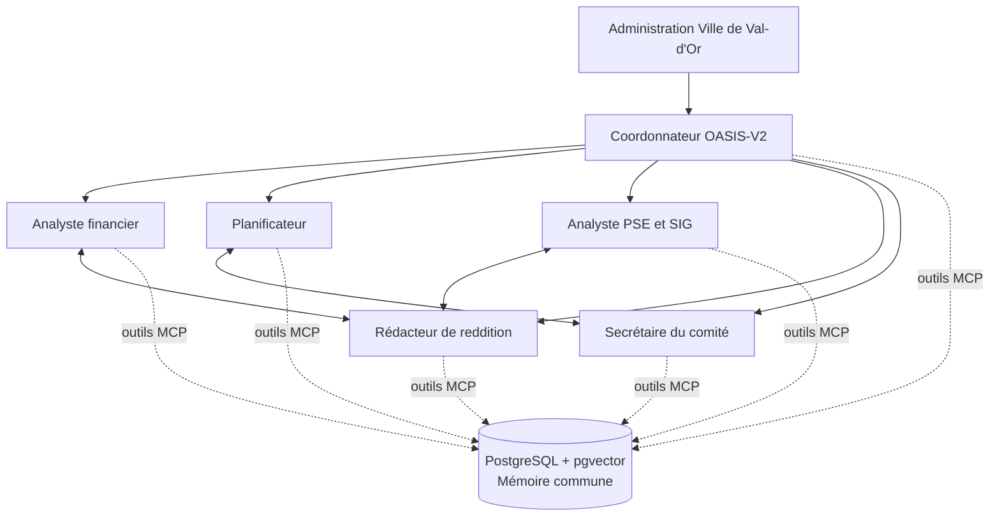

# Spacebot OASIS-V2 — Déploiement local Docker

Cette configuration prépare une instance Spacebot destinée au suivi de la convention **COV_OASIS-V2** de la Ville de Val-d'Or. L’interface Web locale constitue le point d’entrée. Un coordonnateur délègue aux profils spécialisés; les faits, décisions, résultats, risques et références utiles sont enregistrés dans une mémoire commune fondée sur **PostgreSQL + pgvector**, accessible à tous les profils par un serveur MCP local.

> Le service partagé est nécessaire parce que Spacebot isole par défaut la mémoire de chaque agent. Les profils gardent donc une mémoire de conversation propre, tout en utilisant le registre PostgreSQL-vectoriel comme source interagent faisant autorité. [1]

| Élément | Rôle | Persistance |
| --- | --- | --- |
| `spacebot-oasis-v2` | Interface Web, topologie des agents, tâches, conversations, mémoire locale de chaque profil et outils de travail. | `instance/` |
| `oasis-memory-db` | Registre commun relationnel, historique d’audit, liens entre éléments et vecteurs pgvector. | `volumes/postgres/` |
| `oasis-shared-memory` | Serveur MCP interne : écritures contrôlées, recherche sémantique, lecture de dossiers et liens de traçabilité. | Sans état; s’appuie sur PostgreSQL |
| OpenRouter | Routage des modèles de génération et création d’embeddings; les vecteurs générés sont mis en cache dans PostgreSQL. | Compte OpenRouter de la Ville |

## Profils et circulation du travail

| Profil | Mandat principal | Utilise systématiquement | Résultat transmis au coordonnateur |
| --- | --- | --- | --- |
| **Coordonnateur OASIS-V2** | Point d’entrée Web, clarification, planification, délégation et consolidation. | Registre partagé, tâches, liens hiérarchiques. | Plan de travail, synthèse, décisions à approuver. |
| **Analyste financier** | Budget, dépenses, salaires, contrats, appels d’offres, admissibilité et écarts. | Budget approuvé, registre des dépenses, pièces de preuve. | État financier et alertes de conformité. |
| **Planificateur** | Calendrier compressé, Gantt, dépendances et jalons. | Calendrier approuvé, décisions, risques et dates contractuelles. | Version de travail, écarts et actions correctives. |
| **Analyste PSE et SIG** | PSE, KML, superficies, indicateurs et méthode de vulnérabilité. | KML, rapport technique, gabarit PSE, méthode MELCCFP. | Matrice d’indicateurs, calculs et limites SIG. |
| **Rédacteur de reddition** | Rapports d’étape/final, annexes et contrôle de conformité. | PSE, budget, calendrier, résultats et preuves. | Brouillon, liste des annexes et informations manquantes. |
| **Secrétaire du comité** | Convocations, ordres du jour, PV, décisions et relances. | Registre des décisions et risques, calendrier. | PV à valider, plan d’action et suivi des responsables. |

Les liaisons sont préconfigurées dans `config.toml.example`. L’administration municipale encadre le coordonnateur. Celui-ci dirige les cinq profils spécialisés. Des liaisons entre pairs existent entre finances et reddition, PSE/SIG et reddition, ainsi qu’entre calendrier et gouvernance.



## Routage OpenRouter orienté coût

Le routage n’utilise aucun modèle Claude. Les modèles de génération sont sélectionnés dans le catalogue OpenRouter et restent séparés par niveau de responsabilité; le modèle visuel plus coûteux n’est utilisé qu’à la demande pour les documents scannés ou les plans. Les identifiants et prix doivent être revérifiés avant l’activation, puisqu’OpenRouter les fait évoluer. [2]

| Processus | Modèle configuré | Fonction | Justification de coût |
| --- | --- | --- | --- |
| Conversation de l’interface | `openrouter/deepseek/deepseek-v4-flash` | Échanges, suivi de contexte et délégation. | Niveau économique pour les interactions courantes. |
| Analyse / arbitrage | `openrouter/openai/gpt-oss-120b` | Plans complexes, consolidation, rapports sensibles. | Déclenché sur les tâches nécessitant plus de raisonnement. |
| Travailleurs spécialisés | `openrouter/qwen/qwen3.7-flash` | Extraction structurée, tableurs, KML, contrôles et brouillons. | Faible coût pour les tâches fréquentes et répétables. |
| Compaction et cortex | `openrouter/mistralai/mistral-nemo` | Résumés, mémoires et signaux de gestion. | Modèle très économique; aucune décision contractuelle. |
| Documents visuels | `openrouter/google/gemini-2.5-flash-lite` | Lecture ponctuelle de plans, scans et PDF difficiles. | Usage exceptionnel et ciblé. |
| Embeddings communs | `qwen/qwen3-embedding-0.6b` | Recherche vectorielle multilingue dans PostgreSQL. | Généré une seule fois par contenu nouveau ou modifié, puis conservé. |

> Les données envoyées à un modèle OpenRouter restent soumises aux politiques du fournisseur retenu. Le serveur d’embeddings demande explicitement `data_collection: "deny"`; l’équipe TI doit néanmoins valider le traitement externe de documents municipaux avant de déposer des pièces confidentielles. [3]

## Démarrage local

La pile nécessite Docker Engine avec le plugin Compose. Sur la machine locale, clonez le dépôt, rendez-vous dans ce répertoire, puis exécutez les étapes ci-dessous.

```bash
cp .env.example .env
# Éditez .env : OPENROUTER_API_KEY et OASIS_MEMORY_DB_PASSWORD.
chmod 600 .env

./bootstrap_instance.sh

docker compose up -d --build
docker compose ps
```

Ouvrez ensuite <http://127.0.0.1:19898>. L’interface est liée à `localhost` pour ne pas être exposée directement au réseau. Une exposition réseau exige un proxy inverse avec HTTPS, authentification et contrôle d’accès; elle ne doit pas être activée par défaut.

## Ingestion documentaire et livrables

Après le démarrage, copiez les documents originaux dans `instance/shared-workspace/sources/`. Déposez les documents à analyser dans `instance/shared-workspace/ingest/`, puis utilisez l’interface Web pour demander l’analyse et la consignation des résultats. Les versions préparées par les agents sont enregistrées dans `instance/shared-workspace/livrables/`.

| Dossier local | Usage | Versionné dans Git |
| --- | --- | --- |
| `instance/shared-workspace/sources/` | Pièces originales : convention, budget, calendrier, gabarits, KML, rapports. | Non |
| `instance/shared-workspace/ingest/` | Pièces prêtes à être ingérées et indexées. | Non |
| `instance/shared-workspace/livrables/` | Fichiers de travail et livrables produits. | Non |
| `instance/agents/*/data/` | Données internes par profil (SQLite, LanceDB, réglages). | Non |
| `volumes/postgres/` | Mémoire relationnelle et vectorielle interagent. | Non |

## Mémoire partagée : règles d’utilisation

Le serveur `oasis-shared-memory` fournit à chaque travailleur quatre opérations : enregistrer un élément, rechercher sémantiquement, lire un élément et lier deux éléments. Les enregistrements structurés couvrent notamment les décisions, dépenses, contrats, appels d’offres, jalons, indicateurs, projets, livrables, réunions, risques et documents. Chaque écriture conserve l’auteur, les références de source, le statut, l’horodatage et une trace d’audit.

Les éléments susceptibles d’avoir une incidence contractuelle, financière ou réglementaire doivent être enregistrés avec le statut `pending_approval`. Seule une validation humaine peut les faire passer à `approved`. Le serveur ne fournit volontairement aucune opération de suppression physique; une correction doit créer une version remplacée ou un statut `superseded`, de façon à préserver l’audit.

## Sauvegarde et restauration

Arrêtez proprement les conteneurs avant une restauration complète. Sauvegardez ensemble le répertoire `instance/` et le répertoire `volumes/postgres/`; ces deux éléments forment l’état durable du système. Ne copiez jamais `.env` dans un partage non sécurisé ou dans Git.

```bash
# Sauvegarde locale indicative, à adapter aux règles TI municipales.
tar -czf oasis-v2-spacebot-$(date +%F).tar.gz instance volumes
```

## Références

[1] [Spacebot — Agents : isolation des mémoires et liens interagents](../../docs/content/docs/(core)/agents.mdx)

[2] [OpenRouter — Catalogue des modèles texte](https://openrouter.ai/models?output_modalities=text)

[3] [OpenRouter — API Embeddings et contrôle de routage fournisseur](https://openrouter.ai/docs/api-reference/embeddings)
