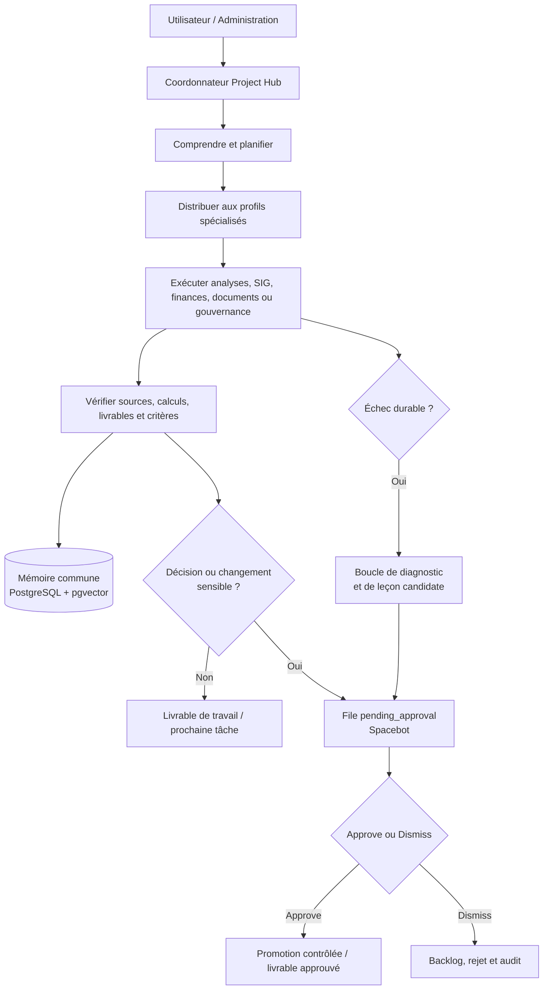
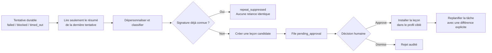

# Framework logique et workflow opérationnel — Project Hub

## Finalité

Le système Project Hub doit transformer une demande de suivi de convention en un résultat **sourcé, classé, vérifiable et prêt à être approuvé**. Son autonomie concerne la compréhension, la planification, la recherche de capacités existantes, l’exécution, le contrôle, l’apprentissage et la préparation de propositions. L’autonomie s’arrête avant toute décision contractuelle, financière, réglementaire, de configuration ou de diffusion externe.

> **Règle directrice :** un agent peut préparer, analyser, tester et proposer; il ne peut jamais présenter comme final un résultat non vérifié ni appliquer seul un changement durable ou sensible.

## Architecture logique



| Couche | Responsabilité | Résultat attendu |
| --- | --- | --- |
| **Administration** | Priorités, décisions, approbation finale et validation métier. | Décision explicite, traçable et datée. |
| **Coordonnateur** | Compréhension de la demande, plan, délégation, consolidation et arbitrage. | Plan de travail, liste de livrables et demande d’approbation lorsque requise. |
| **Profils spécialisés** | Finances, calendrier, données/géomatique, reddition et gouvernance. | Analyse, brouillon, calcul, écart, risque ou pièce de preuve. |
| **Services locaux** | Mémoire, SIG, documents, DSPy, SkillOpt, mineur et remédiateur. | Résultat technique local, candidat ou trace d’audit. |
| **Pont d’approbation** | Conversion des propositions en tâches Web et application strictement après approbation. | Tâche `pending_approval`, manifeste de promotion ou de rejet. |

## Workflow normal d’une demande

### 1. Réception et qualification

Le coordonnateur identifie l’objectif, les livrables attendus, les échéances, les sources disponibles, les contraintes de coût et le niveau d’approbation nécessaire. Il distingue immédiatement un besoin d’information, un brouillon, une analyse, une décision ou une transmission officielle.

| Question de qualification | Exemple de réponse attendue |
| --- | --- |
| Quel résultat faut-il produire ? | Gantt, état financier, calcul de superficie, programme de suivi, PV ou rapport d’étape. |
| Quelle source fait autorité ? | Convention, budget approuvé, calendrier ministériel, KML, facture ou décision du comité. |
| Quel profil est responsable ? | Finances, calendrier, données/géomatique, reddition ou gouvernance. |
| Quelle validation est requise ? | Contrôle technique, validation SIG, approbation financière ou approbation finale de l’administration. |

### 2. Planification et décomposition

Le coordonnateur découpe le travail en tâches distinctes et bornées. Chaque tâche contient un objectif, un résultat attendu, les sources à consulter, des critères de vérification, une échéance et un profil responsable. Les tâches interdépendantes sont reliées, sans multiplier les branches inutiles.

Une tâche est considérée prête seulement si elle répond aux questions suivantes : **quoi produire, à partir de quelles sources, selon quels critères, pour quel responsable et avec quelle limite d’autonomie**.

### 3. Prévol de capacités

Avant de créer du code, d’appeler un MCP ou de chercher une compétence externe, le profil vérifie dans cet ordre : les compétences chargées, les gabarits, les scripts présents, les outils intégrés, les MCP disponibles et les données du registre partagé. Une capacité existante est réutilisée avant toute création.

| Situation | Action autonome autorisée | Porte de sécurité |
| --- | --- | --- |
| Script local absent mais réalisable avec Python standard | Créer, compiler et tester un script dans le dossier partagé autorisé. | README, `py_compile`, essai non destructif et classement. |
| Compétence existante trouvée localement | La lire et l’utiliser. | Aucune installation. |
| Compétence externe potentiellement utile | La rechercher avec `skills_search` et préparer une proposition. | Approbation UI obligatoire avant installation. |
| MCP, dépendance, secret, modèle ou Docker manquant | Décrire le besoin, les coûts, les tests et le plan de retrait. | Jamais d’activation autonome. |

### 4. Exécution spécialisée

Le profil traite les données dans son workspace privé et écrit les sources, calculs et livrables collaboratifs dans l’espace partagé autorisé. Il conserve les frontières de rôle : l’analyste financier ne valide pas seul un engagement; le données/géomatique ne déclare pas une superficie officielle sans validation SIG; le rédacteur ne diffuse pas un rapport; le secrétaire ne simule pas l’adoption d’un PV.

### 5. Contrôle et traçabilité

Avant de conclure, le profil vérifie la source, la date, la cohérence des calculs, les hypothèses, les écarts et le niveau de validation. Les résultats vérifiables sont inscrits dans la mémoire commune avec un statut, des références de source et le chemin de l’artefact classé. Les livrables suivent le cycle : brouillon → revue qualité → approuvé → transmis.

### 6. Consolidation et décision

Le coordonnateur consolide les résultats spécialisés et prépare une recommandation. Si le résultat ne change aucun engagement ni information officielle, le travail peut revenir comme livrable de travail. Si une décision, un changement de budget ou calendrier, une promotion d’apprentissage, une compétence externe ou une transmission est concernée, une tâche Spacebot est créée dans `pending_approval`.

### 7. Approbation humaine dans Spacebot

L’utilisateur consulte la file d’approbation dans l’interface Web et examine les artefacts, sources, scores, diff ou conséquences. **Approve** fait passer la tâche à `ready`; le pont applique seulement l’action déjà délimitée, écrit un audit, puis clôt la tâche. **Dismiss** replace la tâche dans `backlog`, marque la proposition rejetée et n’applique aucun changement.

## Boucle d’apprentissage après un échec



La boucle diagnostique notamment un outil absent, un MCP indisponible, une compétence insuffisante, une consigne ambiguë ou une tâche trop large. Elle masque les données sensibles, conserve une signature de l’échec et limite le volume quotidien de candidates. Elle ne relance jamais automatiquement la tâche source.

Après l’approbation d’une leçon, le coordonnateur doit modifier le plan ou créer une tâche de suivi avant toute reprise. Cela garantit qu’une nouvelle tentative diffère réellement de la précédente.

## Workflow de compétence externe

Une compétence externe suit un cycle séparé, car elle introduit des instructions d’un dépôt tiers.

1. L’agent recherche une compétence avec `skills_search` et examine la description, la source, les dépendances et la portée.
2. Il crée une proposition `capability_skill_acquisition` contenant la source exacte, l’agent ciblé, les contraintes, les tests envisagés et l’absence de changement MCP, Docker, modèle, secret, permission ou dépendance système.
3. Le pont crée une tâche `pending_approval` dans Spacebot.
4. Après **Approve**, le pont écrit une autorisation dédiée hors des workspaces agents sous `instance/skill-install-authorizations/`.
5. Le moteur Spacebot refuse toute installation dont la source ou le profil ne correspond pas exactement à cette autorisation.
6. L’agent ciblé installe la compétence dans son workspace privé, la lit, la teste sur une tâche non sensible et consigne le résultat.

> L’approbation autorise une source précise pour un profil précis; elle n’autorise jamais un MCP, un binaire système, une dépendance, un secret, un modèle, Docker ou un élargissement de permissions.

## États de référence

| Objet | États principaux | Sens |
| --- | --- | --- |
| Tâche de travail | `ready` → `in_progress` → `done` | Travail exécutable, en cours puis terminé. |
| Tâche d’approbation | `pending_approval` → `ready` | Décision humaine nécessaire, puis action autorisée. |
| Proposition | `pending_approval` / `approved_promoted` / `rejected_by_user` | Candidate bloquée, appliquée après approbation ou rejetée. |
| Échec | `observed` / `repeat_suppressed` / `approved_lesson_active` | Cas observé, répétition bloquée ou leçon approuvée. |
| Livrable | brouillon → revue qualité → approuvé → transmis | Cycle documentaire officiel. |

## Rythme d’exploitation recommandé

| Rythme | Action | Responsable |
| --- | --- | --- |
| À chaque demande | Qualification, plan, délégation et critères de vérification. | Coordonnateur. |
| À chaque résultat | Classement, sources, mémoire commune et contrôle qualité. | Profil exécutant. |
| Après un échec | Diagnostic, déduplication, leçon candidate si nécessaire. | Remédiateur local et profil. |
| Toutes les 24 heures au plus | Mineur de références, évaluation DSPy/SkillOpt dans les limites définies. | Services locaux. |
| À chaque proposition | Examen dans la file `pending_approval`. | Administration. |
| Avant une transmission | Relecture métier, validation SIG/financière et approbation humaine. | Administration et responsable métier. |

## Règles non négociables

Le système ne doit jamais modifier seul la configuration Spacebot, les modèles, les MCP, Docker, les secrets, les permissions ou les dépendances système. Il ne doit jamais transmettre un document officiel, valider une superficie SIG, modifier un calendrier contractuel, engager une dépense ou approuver un rapport sans décision humaine explicite. Les données brutes municipales ne deviennent jamais des cas d’apprentissage; seules des références approuvées, admissibles, sourcées et dépersonnalisées peuvent alimenter les boucles DSPy ou SkillOpt.

## Repères de classement

```text
instance/shared-workspace/
├── 01_sources/                 # Pièces d’entrée et sources classées
├── 02_finances/ à 06_reddition/# Dossiers de travail métier
├── 07_livrables/               # Brouillons, revue, approuvés, transmis
├── 00_systeme/scripts/         # Scripts Python locaux classés par agent
├── 00_systeme/propositions_capacites/
│                                # Demandes externes en attente de revue
└── 00_systeme/optimisation/    # DSPy, SkillOpt, mineur, remédiation, audits

instance/agents/<agent-id>/workspace/
└── skills/                     # Compétences privées du profil

instance/skill-install-authorizations/
└── *.json                      # Autorisations UI réservées, hors des workspaces
```
