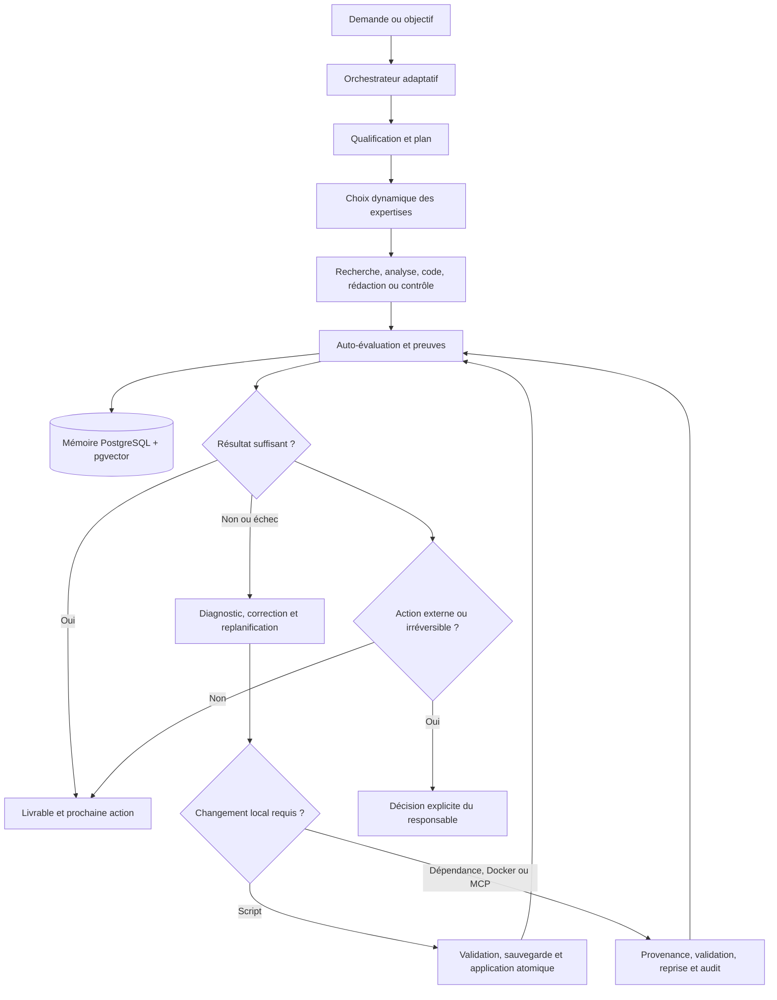

# Framework logique et workflow — Autonomous Task Hub

## Finalité

Autonomous Task Hub transforme une demande en travail structuré, sourcé, testé et progressivement amélioré. Son autonomie couvre la compréhension, la planification, la délégation, la recherche, la production, le contrôle, le diagnostic d’échec, la correction de scripts et l’évolution contrôlée de l’environnement local.

> **Principe directeur :** les agents ne restent pas bloqués devant une tâche. Ils créent le plus petit prochain pas utile, conservent les preuves, évaluent le résultat, changent de stratégie après un échec et enregistrent ce qui a été appris.

## Architecture logique



| Couche | Responsabilité | Trace durable |
| --- | --- | --- |
| Responsable | Priorités, objectifs et seules décisions critiques. | Tâche, décision et commentaire. |
| Orchestrateur | Compréhension, planification, routage, consolidation et relance. | Plan et état des tâches. |
| Profils spécialisés | Recherche, planification, analyse, code, rédaction, revue et apprentissage. | Artefacts classés et mémoire partagée. |
| Services locaux | Mémoire, documents, DSPy, SkillOpt, remédiation et évolution. | Propositions, tests, sauvegardes et audits. |
| Réviseur | Contradictions, critères, limites et test minimal. | Revue qualité et prochaines corrections. |

## Cycle de travail adaptatif

L’orchestrateur qualifie l’objectif, le livrable, les sources, les critères et l’incertitude. Il découpe seulement les unités utiles et choisit les expertises selon le besoin réel, non selon une séquence rigide. Les agents réutilisent la mémoire, scripts, modèles et compétences disponibles avant de créer de nouveaux éléments.

Chaque résultat est classé avec ses sources, méthodes, hypothèses, preuves de test et limites. Le réviseur confronte la sortie aux critères de réussite, à un contre-exemple plausible et aux données manquantes. Lorsque le travail est incomplet, le plan est corrigé ou une tâche de suivi est créée avec un blocage concret.

## Auto-correction des échecs

Un échec durable est dépersonnalisé, classé et dédupliqué par signature. La prochaine tentative doit différer : autre découpage, test supplémentaire, source nouvelle, méthode plus simple ou autre expertise. La répétition identique est supprimée pour éviter les boucles coûteuses.

## Auto-amélioration locale

### Scripts et code de travail

Les scripts placés sous `05_automatisation/01_scripts/` peuvent être corrigés automatiquement. Une candidate contient le chemin relatif, le contenu complet, l’empreinte de la version de départ, la justification et les contraintes. Le contrôleur vérifie le chemin, la syntaxe, l’empreinte, sauvegarde la version précédente, applique atomiquement la candidate et écrit un audit. Une candidate invalide ou fondée sur une version dépassée reste sans effet.

| Étape | Contrôle automatique |
| --- | --- |
| Candidate | Chemin autorisé, format et taille limités. |
| Version de départ | Empreinte identique à la version observée. |
| Validation | Syntaxe Python, JavaScript ou shell. |
| Application | Sauvegarde horodatée et écriture atomique. |
| Traçabilité | Audit, preuve de validation et retour arrière. |

### Dépendances, Docker et MCP

Le contrôleur d’environnement traite des propositions typées, jamais des commandes libres. Une dépendance doit inclure un paquet et une version exacte; l’installation s’effectue sans scripts de cycle de vie avant la vérification du verrou. Un changement Docker est validé avec `docker compose config`, puis reconstruit et redémarré; en cas d’échec, les fichiers et services sont restaurés. Un changement MCP est limité au fichier local d’instance, ne peut modifier que les déclarations MCP, vérifie les endpoints locaux et redémarre le service concerné.

Ces flux sont locaux, journalisés et réversibles. Ils ne manipulent pas les secrets, permissions, données sources ou transmissions externes.

## Apprentissage des tâches terminées

Le mineur de références récupère uniquement les résultats explicitement `completed=true`, `approved` et `learning_eligible=true`. Il élimine les données sensibles, sépare les partitions et crée des packs temporaires. DSPy et SkillOpt mesurent des candidates avec des plafonds de coût et de temps. Les résultats préparent des instructions ou compétences plus efficaces sans confondre une évaluation limitée avec une vérité générale.

## Limites critiques

Le système ne transmet ni ne publie de contenu, ne conclut pas d’achat, ne modifie pas les permissions, n’expose pas de secret et n’accède pas à une ressource externe non fournie. Ces actions restent réservées au responsable. Le reste du cycle de travail local progresse avec preuve, test, audit et possibilité de retour arrière.

## Repères de classement

```text
instance/shared-workspace/
├── 01_sources/                 # Entrées, références et données
├── 02_recherche/               # Questions, preuves et options
├── 03_planification/           # Objectifs, plan et risques
├── 04_analyse/                 # Méthodes, données et calculs
├── 05_automatisation/          # Scripts et tests locaux
├── 06_communications/          # Notes et brouillons
├── 07_livrables/               # Brouillons, QA, approuvés, transmis
└── 00_systeme/optimisation/    # Apprentissage, remédiation et évolution
```
